- [犹太式学习方式.png](./pic/1/01犹太式学习方式.png)

- [性格特质的分类.png](./pic/1/02性格特质的分类.png)

- [个人性格成因.png](./pic/1/03个人性格成因.png)
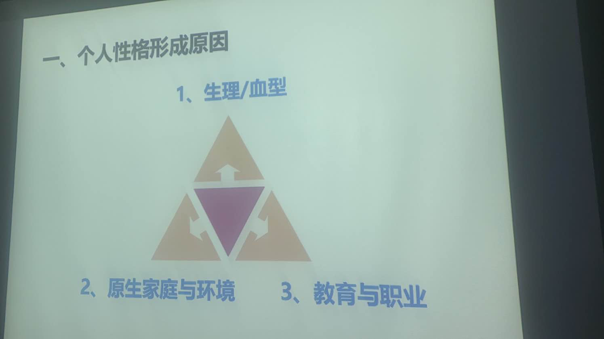

- [红黄蓝绿四个小孩.png](./pic/1/04红黄蓝绿四个小孩.png)
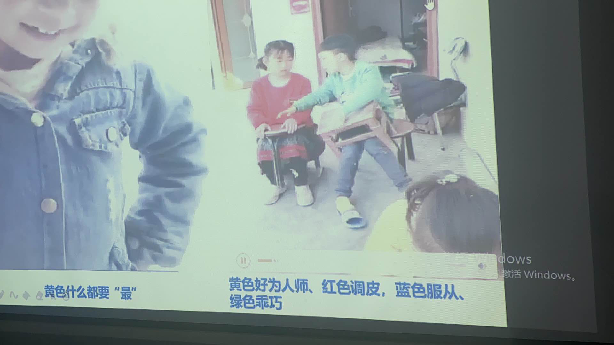

- [孩子与家庭表现对照.png](./pic/1/05孩子与家庭表现对照.png)

- [教育、职业与社会对性格的影响.png](./pic/1/06教育、职业与社会对性格的影响.png)

- [四种性格基本特征.jpeg](./pic/1/07四种性格基本特征.jpeg)
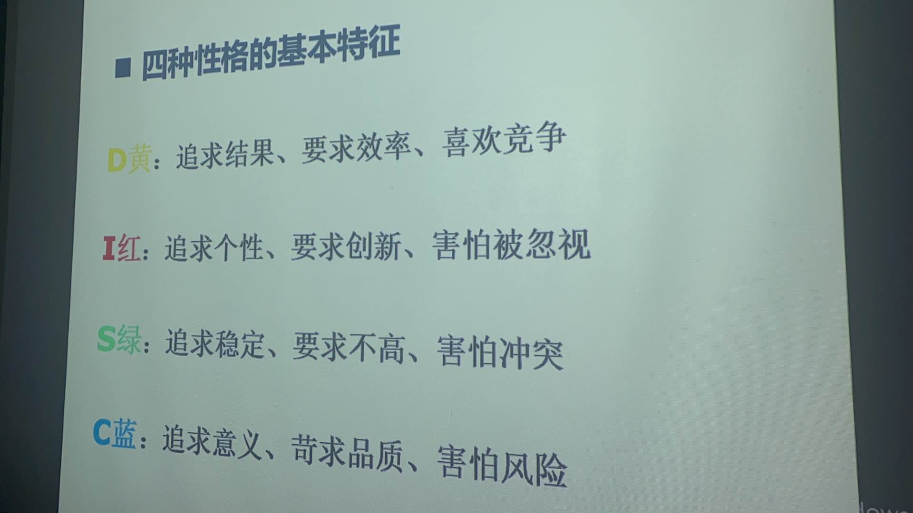

- [四种性格基本特征2.jpeg](./pic/1/07四种性格基本特征2.jpeg)

- [四种性格的内在动机.jpeg](./pic/1/08四种性格的内在动机.jpeg)
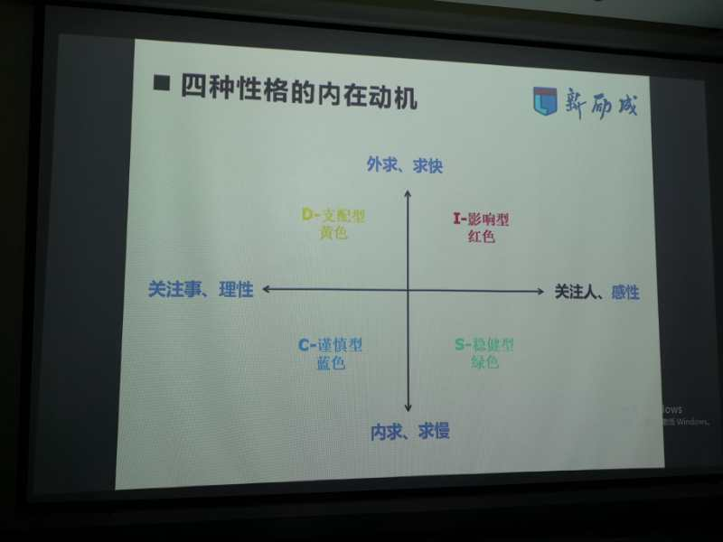

- [性格饼图与行为的关系.jpeg](./pic/1/09性格饼图与行为的关系.jpeg)
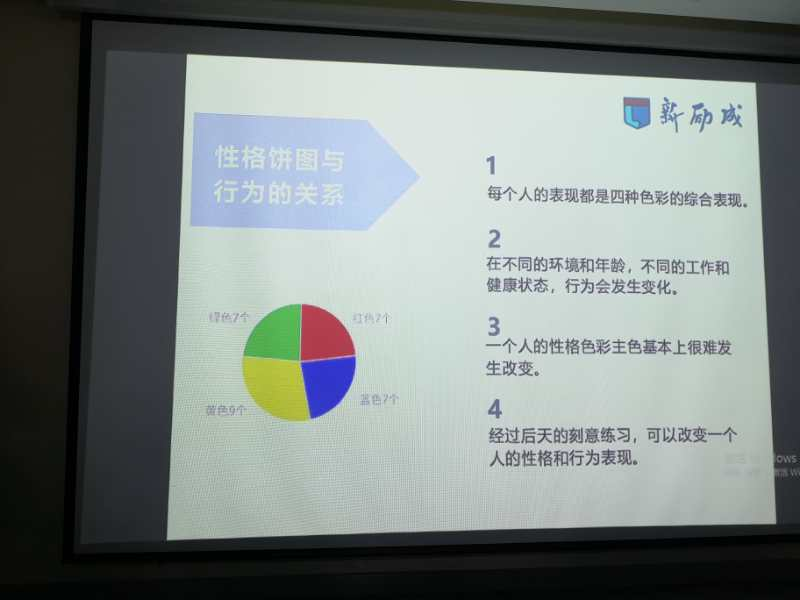

- [小刺猬视频.mp4](./pic/1/10小刺猬视频.mp4)

- [关于性格的金句.jpeg](./pic/1/11关于性格的金句.jpeg)
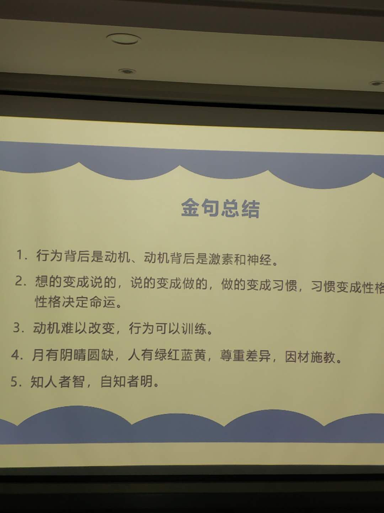

- [绿色性格的优势.jpeg](./pic/2/1green/00绿色性格的优势.jpeg)

- [绿色性格的辨别方法.jpeg](./pic/2/1green/01绿色性格的辨别方法.jpeg)

- [绿色沟通特点.jpeg](./pic/2/1green/02绿色沟通特点.jpeg)
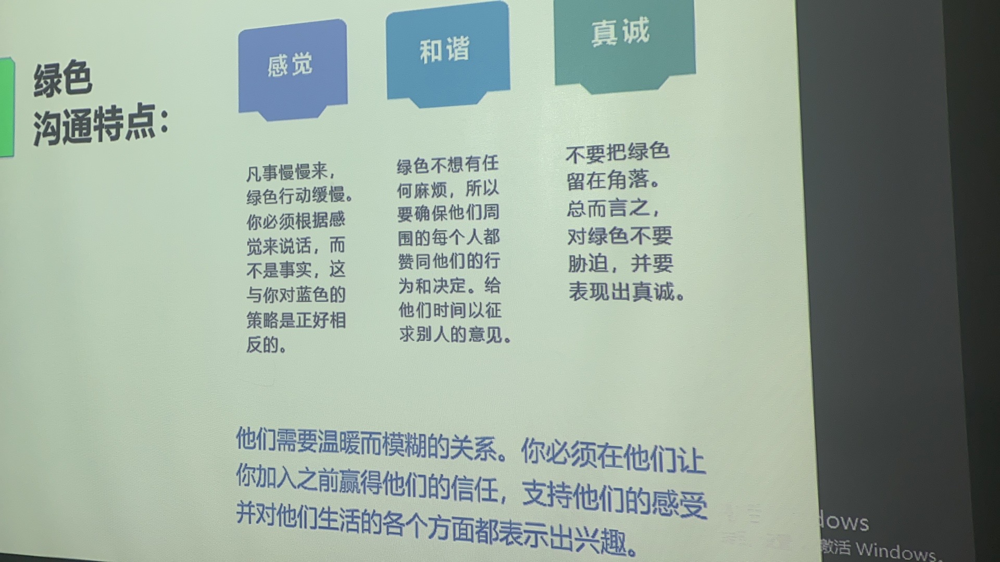

- [绿色女性.jpeg](./pic/2/1green/03绿色女性.jpeg)

- [绿色男性.jpeg](./pic/2/1green/04绿色男性.jpeg)

- [绿色金句.jpeg](./pic/2/1green/05绿色金句.jpeg)
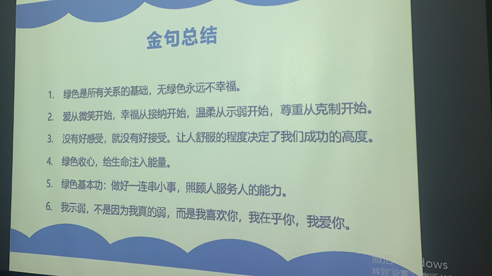

- [讨论绿色性格特质.jpeg](./pic/2/1green/06讨论绿色性格特质.jpeg)
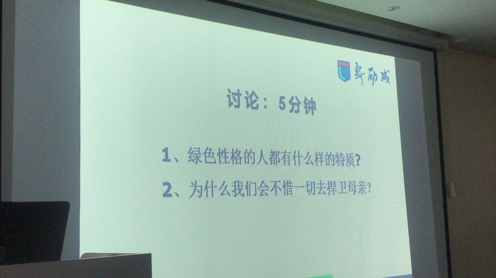

- [视频_感恩要及时_子欲养而亲不在.jpeg](./pic/2/1green/07视频_感恩要及时_子欲养而亲不在.jpeg)
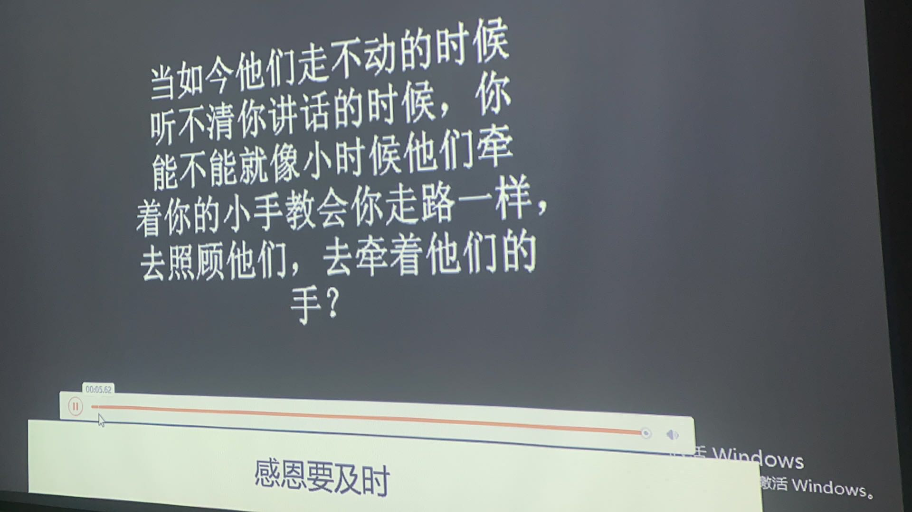

- [绿色性格激活黄色性格示范_50离地俯卧撑_30单手俯卧撑.mp4](./pic/2/1green/08绿色性格激活黄色性格示范_50离地俯卧撑_30单手俯卧撑.mp4)

- [课后作业.jpeg](./pic/2/1green/09课后作业.jpeg)

- [蓝色性格优势.jpeg](./pic/2/2blue/05蓝色性格优势.jpeg)

- [蓝色男性.jpeg](./pic/2/2blue/06蓝色男性.jpeg)

- [蓝色性格辨别方法.jpeg](./pic/2/2blue/07蓝色性格辨别方法.jpeg)

- [蓝色沟通特点.jpeg](./pic/2/2blue/08蓝色沟通特点.jpeg)

- [蓝色金句总结.jpeg](./pic/2/2blue/09蓝色金句总结.jpeg)
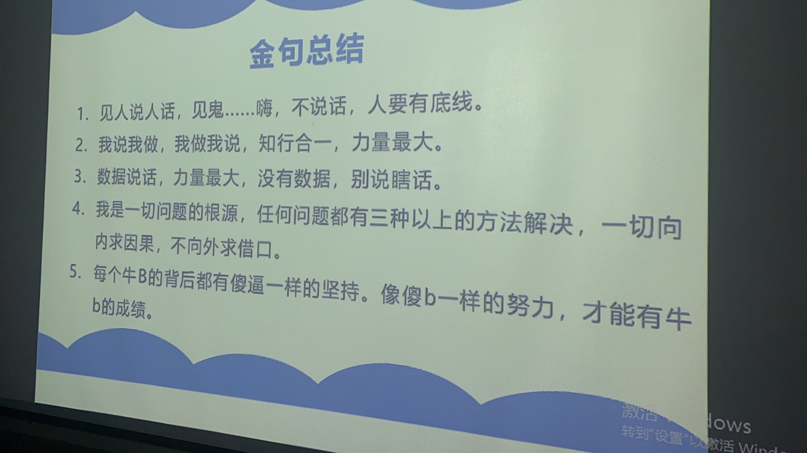

- [红色优势.jpeg](./pic/2/3red/10红色优势.jpeg)
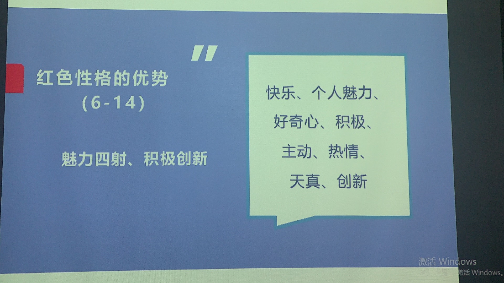

- [红色宝宝示范.mp4](./pic/2/3red/11红色宝宝示范.mp4)

- [调动红色的歌曲_海阔天空.mp4](./pic/2/3red/12调动红色的歌曲_海阔天空.mp4)

- [红色性格的辨别方法.jpeg](./pic/2/3red/13红色性格的辨别方法.jpeg)

- [红色代表人物.jpeg](./pic/2/3red/14红色代表人物.jpeg)
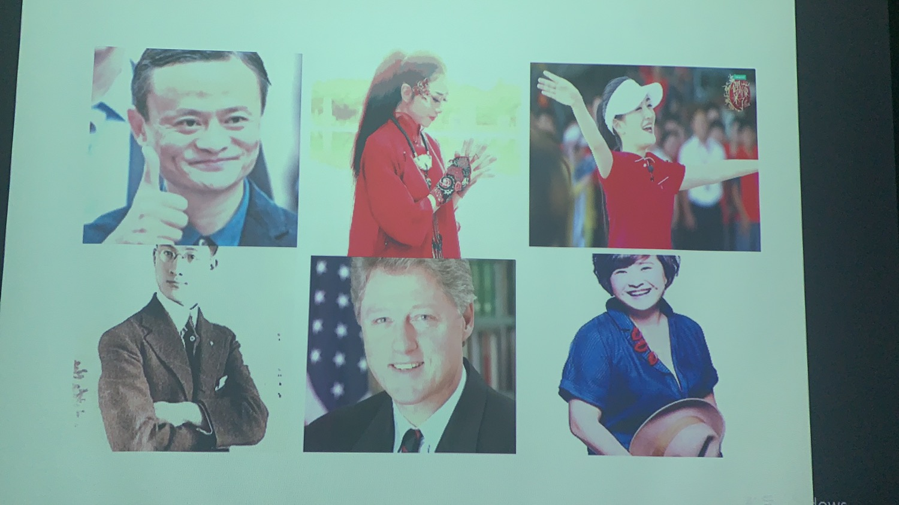

- [红色性格的沟通特点.jpeg](./pic/2/3red/15红色性格的沟通特点.jpeg)

- [红色金句总结.jpeg](./pic/2/3red/16红色金句总结.jpeg)

- [黄色性格优势.jpeg](./pic/2/4yellow/18黄色性格优势.jpeg)
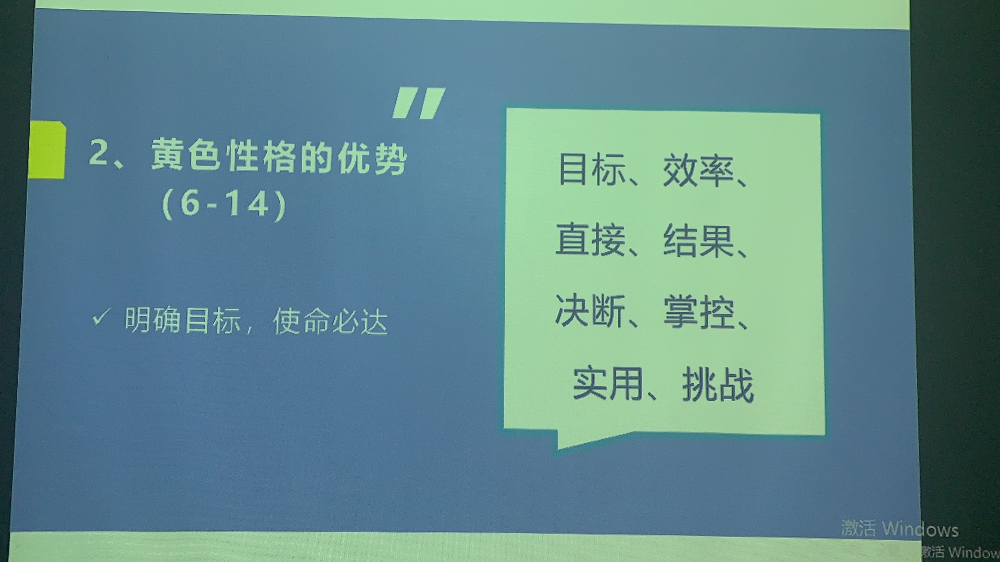

- [调动黄色的歌曲.mp4](./pic/2/4yellow/19调动黄色的歌曲.mp4)

- [黄色性格辨别方法.jpeg](./pic/2/4yellow/20黄色性格辨别方法.jpeg)
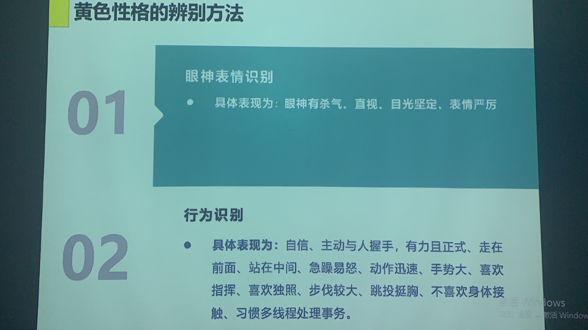

- [不同性格的幽默方式.jpeg](./pic/2/4yellow/21不同性格的幽默方式.jpeg)

- [黄色性格辨别方法2.jpeg](./pic/2/4yellow/21黄色性格辨别方法2.jpeg)

- [黄色代表人物.jpeg](./pic/2/4yellow/22黄色代表人物.jpeg)
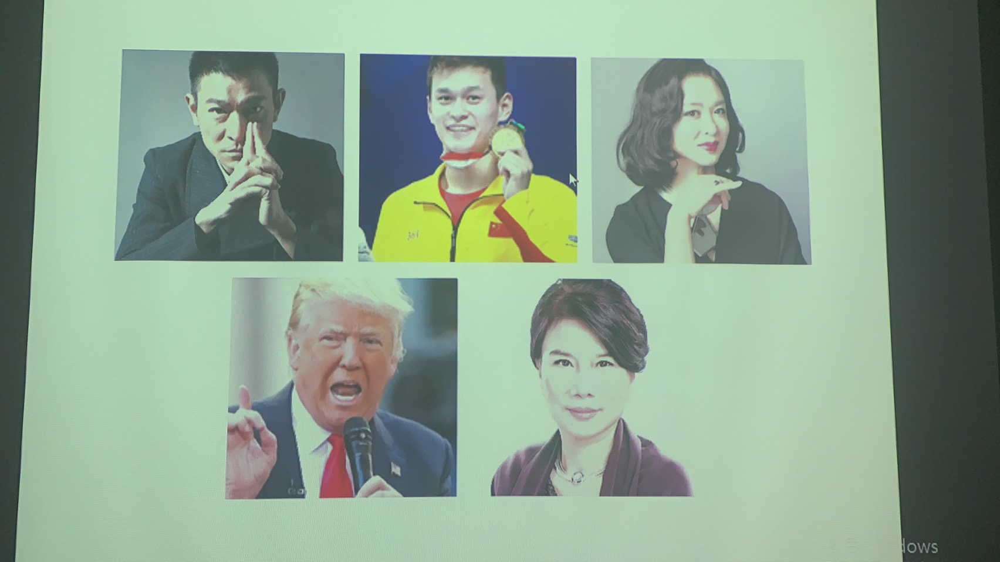

- [黄色沟通特点.jpeg](./pic/2/4yellow/23黄色沟通特点.jpeg)

- [黄色金句总结.jpeg](./pic/2/4yellow/24黄色金句总结.jpeg)

- [第三讲性格的运用.jpeg](./pic/3/25第三讲性格的运用.jpeg)

- [开始一件事方式和障碍_红_绿.jpeg](./pic/3/26开始一件事方式和障碍_红_绿.jpeg)

- [开始一件事方式和障碍_黄_蓝.jpeg](./pic/3/27开始一件事方式和障碍_黄_蓝.jpeg)

- [对时间管理的态度.jpeg](./pic/3/28对时间管理的态度.jpeg)
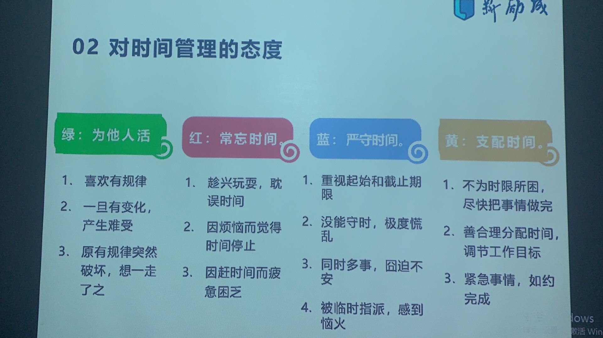

- [压力的来源和调节_红_绿.jpeg](./pic/3/29压力的来源和调节_红_绿.jpeg)

- [压力的来源和调节_蓝_黄.jpeg](./pic/3/30压力的来源和调节_蓝_黄.jpeg)
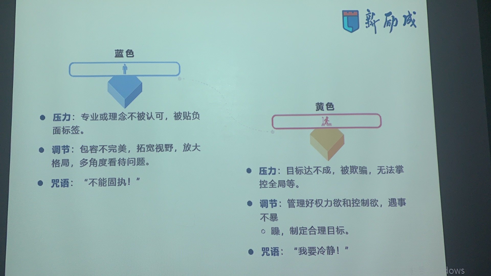

- [进入陌生场合的做法.jpeg](./pic/3/31进入陌生场合的做法.jpeg)

- [不同性格的幽默方式.jpeg](./pic/3/32不同性格的幽默方式.jpeg)

- [如何避免吵架和冲突.jpeg](./pic/3/33如何避免吵架和冲突.jpeg)

- [不同性格面对被骂的反应.jpeg](./pic/3/34不同性格面对被骂的反应.jpeg)

- [不同性格的记仇和报复方式.jpeg](./pic/3/35不同性格的记仇和报复方式.jpeg)

- [不同性格的人如何夸奖.jpeg](./pic/3/36不同性格的人如何夸奖.jpeg)

- [如何追不同性格的对象.jpeg](./pic/3/37如何追不同性格的对象.jpeg)
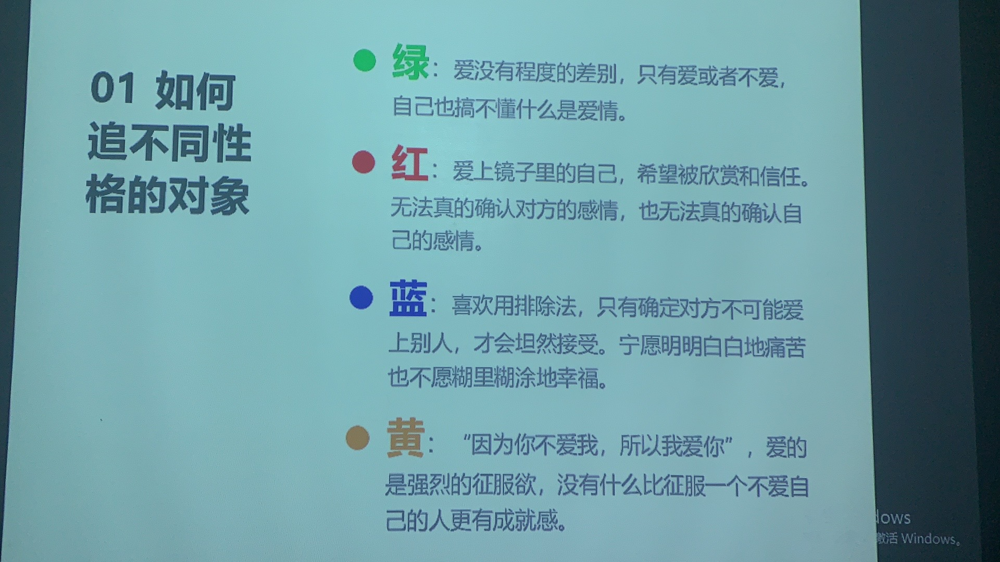

- [不同性格的人如何面对婚姻.jpeg](./pic/3/38不同性格的人如何面对婚姻.jpeg)

- [如何与不同性格的伴侣相处_绿_红.jpeg](./pic/3/39如何与不同性格的伴侣相处_绿_红.jpeg)

- [如何与不同性格的人相处_蓝_黄.jpeg](./pic/3/40如何与不同性格的人相处_蓝_黄.jpeg)
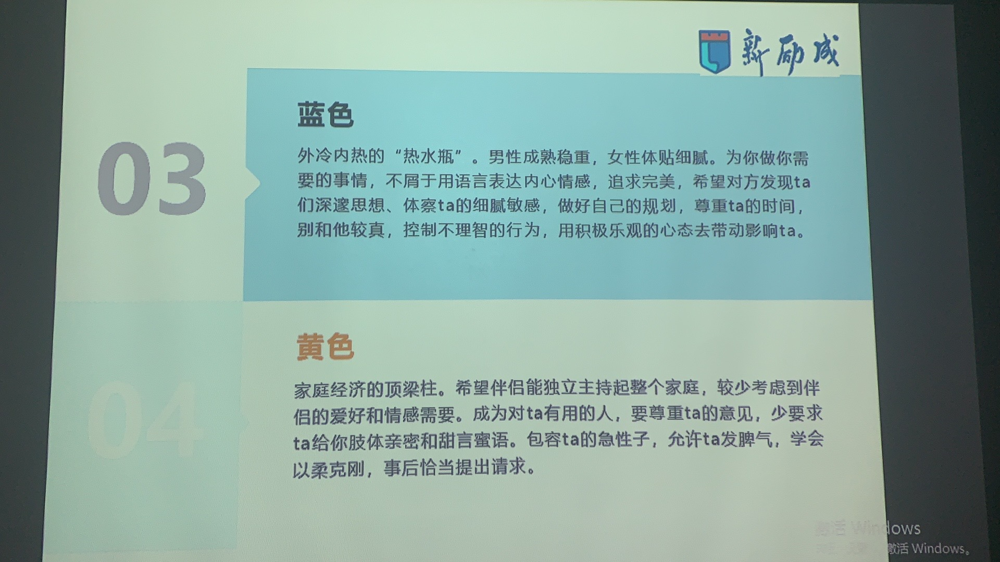

- [不同性格女人产生怀疑的做法.jpeg](./pic/3/41不同性格女人产生怀疑的做法.jpeg)
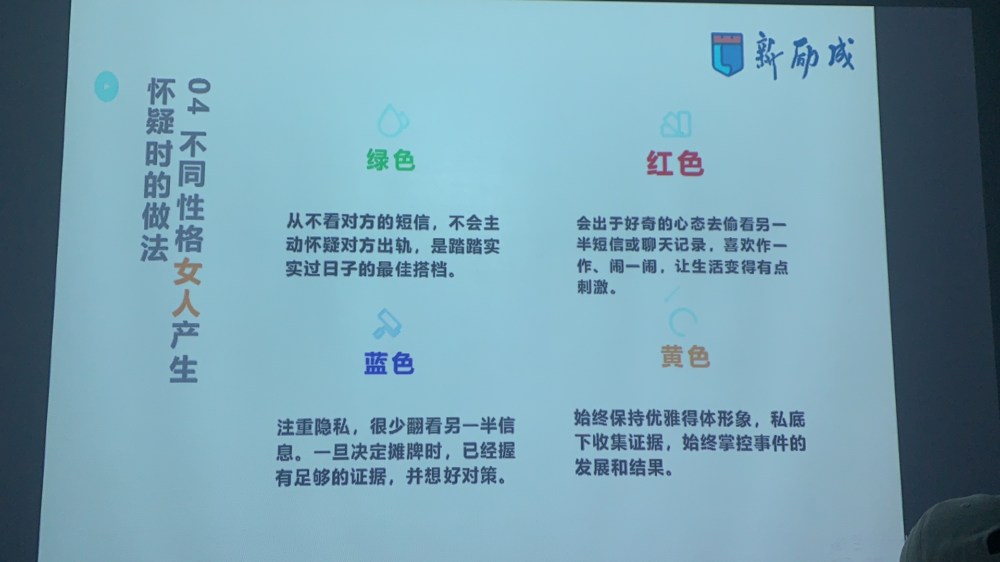

- [不同性格男人产生怀疑的做法.jpeg](./pic/3/42不同性格男人产生怀疑的做法.jpeg)

- [如何消灭不同性格的出轨.jpeg](./pic/3/43如何消灭不同性格的出轨.jpeg)

- [不同性格失恋后的反应.jpeg](./pic/3/44不同性格失恋后的反应.jpeg)
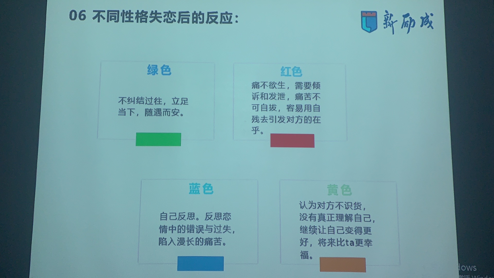

- [不同性格父母如何教育孩子_绿_红.jpeg](./pic/3/45不同性格父母如何教育孩子_绿_红.jpeg)

- [不同性格父母如何教育孩子_蓝_黄.jpeg](./pic/3/46不同性格父母如何教育孩子_蓝_黄.jpeg)
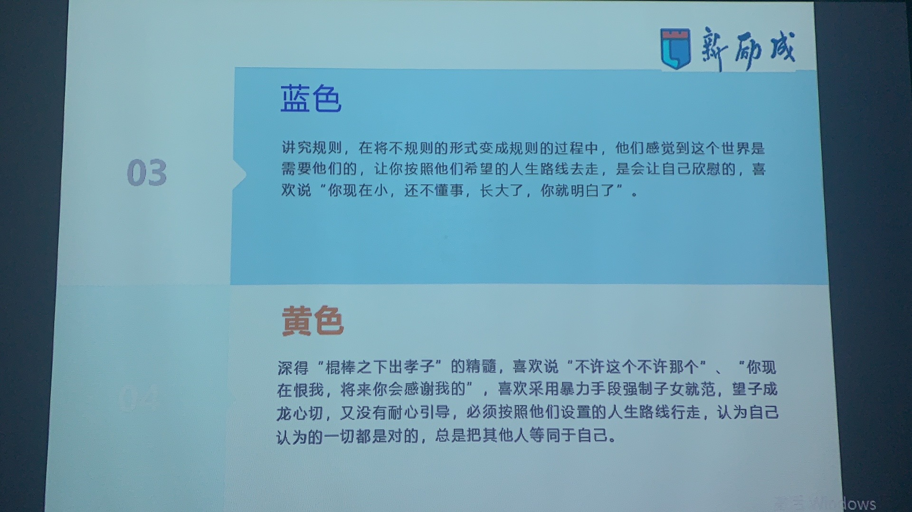

- [不同性格孩子如何教育_绿_红.jpeg](./pic/3/47不同性格孩子如何教育_绿_红.jpeg)

- [不同性格孩子如何教育_蓝_黄.jpeg](./pic/3/48不同性格孩子如何教育_蓝_黄.jpeg)
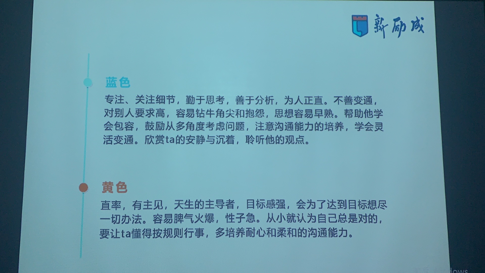

- [不同性格如何选择职业_绿.jpeg](./pic/3/49不同性格如何选择职业_绿.jpeg)

- [不同性格如何选择职业_红.jpeg](./pic/3/50不同性格如何选择职业_红.jpeg)
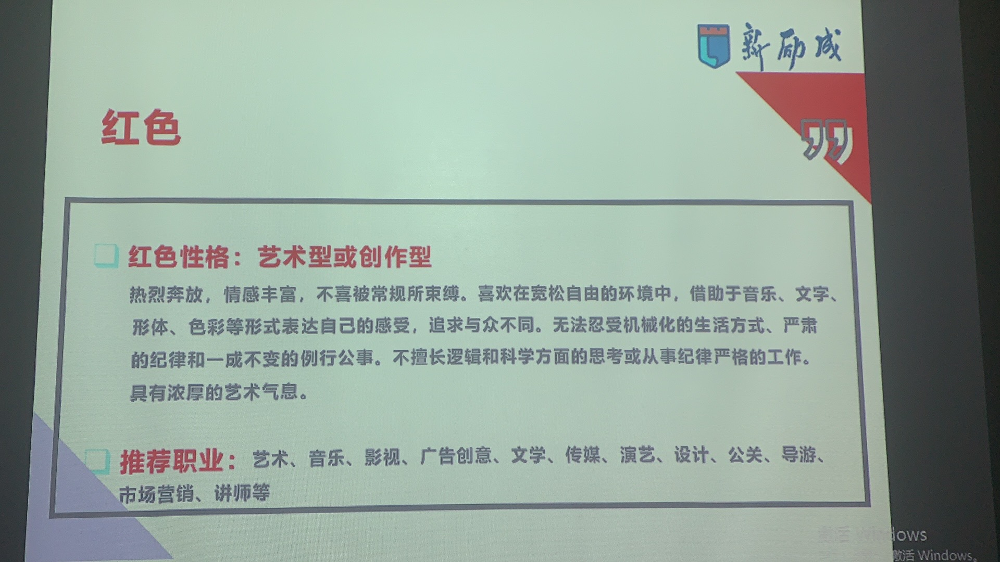

- [不同性格如何选择职业_蓝.jpeg](./pic/3/51不同性格如何选择职业_蓝.jpeg)

- [不同性格如何选择职业_黄.jpeg](./pic/3/52不同性格如何选择职业_黄.jpeg)
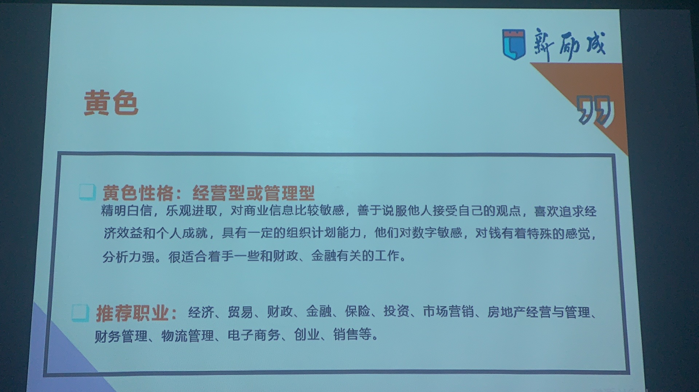

- [不同性格如何面对规则.jpeg](./pic/3/53不同性格如何面对规则.jpeg)
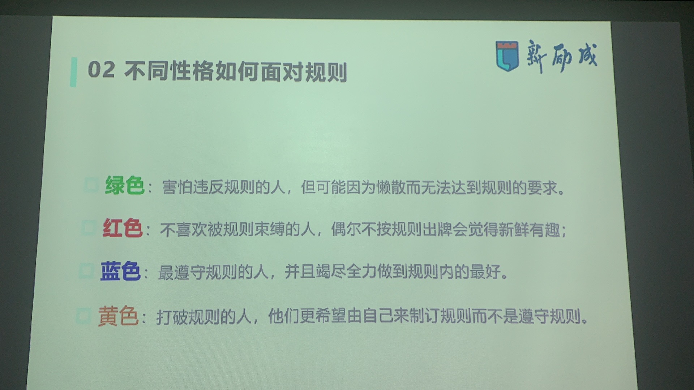

- [不同性格如何在团队中发挥作用_红_绿.jpeg](./pic/3/54不同性格如何在团队中发挥作用_红_绿.jpeg)

- [不同性格如何在团队中发挥作用_蓝_黄.jpeg](./pic/3/55不同性格如何在团队中发挥作用_蓝_黄.jpeg)

- [如何与不同性格同事相处_绿_红.jpeg](./pic/3/56如何与不同性格同事相处_绿_红.jpeg)

- [如何与不同性格同事相处_蓝_黄.jpeg](./pic/3/57如何与不同性格同事相处_蓝_黄.jpeg)
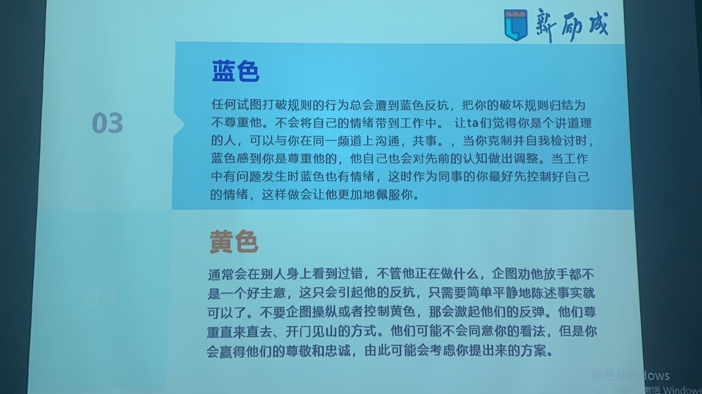

- [如何影响不同性格的下属_蓝_绿.jpeg](./pic/3/58如何影响不同性格的下属_蓝_绿.jpeg)

- [如何影响不同性格的下属_黄_红.jpeg](./pic/3/59如何影响不同性格的下属_黄_红.jpeg)

- [如何与不同性格老板谈加薪_蓝_绿.jpeg](./pic/3/60如何与不同性格老板谈加薪_蓝_绿.jpeg)

- [如何与不同性格老板谈加薪_黄_红.jpeg](./pic/3/61如何与不同性格老板谈加薪_黄_红.jpeg)

- [不同性别的客户如何销售与服务.jpeg](./pic/3/62不同性别的客户如何销售与服务.jpeg)
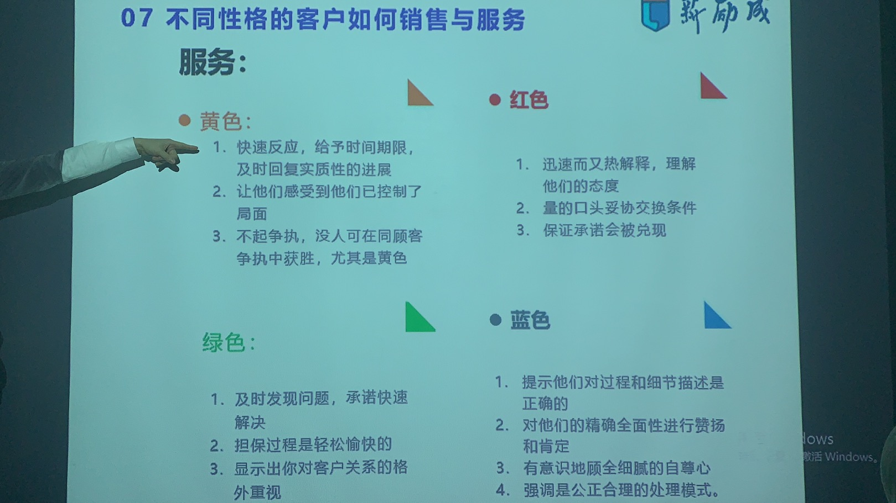

- [课后读书_玩转DISC.jpeg](./pic/3/63课后读书_玩转DISC.jpeg)

- [学员分享分析.jpeg](./pic/4/01学员分享分析.jpeg)
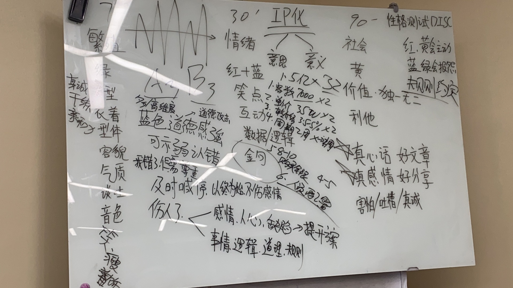

- [各色过当与缺陷的数值参考.jpeg](./pic/4/02各色过当与缺陷的数值参考.jpeg)

- [性格分裂与完美人格的数值参考.jpeg](./pic/4/03性格分裂与完美人格的数值参考.jpeg)

- [四色过当的表现_绿_蓝.jpeg](./pic/4/04四色过当的表现_绿_蓝.jpeg)
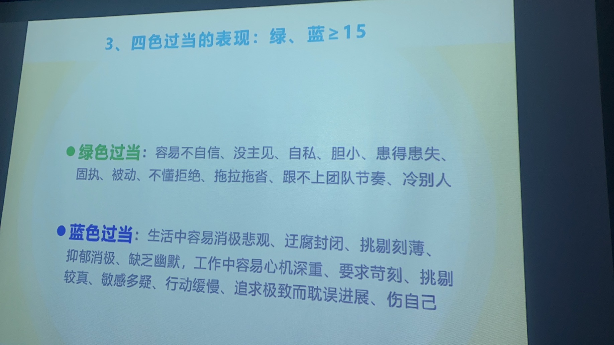

- [四色过当的表现_红_黄.jpeg](./pic/4/05四色过当的表现_红_黄.jpeg)

- [四色缺陷的表现.jpeg](./pic/4/06四色缺陷的表现.jpeg)

- [四种性格调整的底层逻辑.jpeg](./pic/4/07四种性格调整的底层逻辑.jpeg)

- [各色特质.jpeg](./pic/4/08各色特质.jpeg)
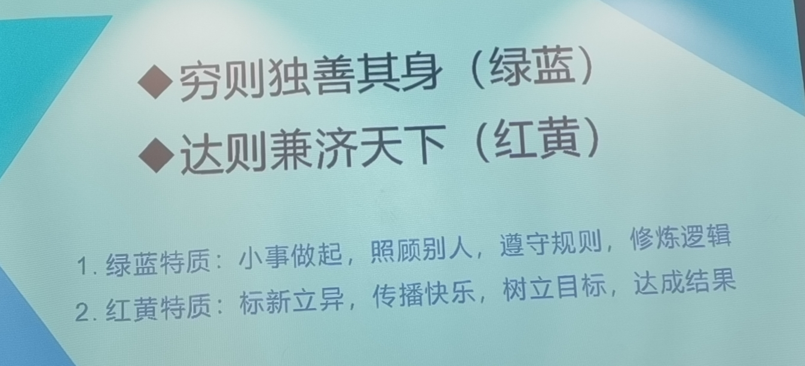

- [各色调整后的好处.jpeg](./pic/4/09各色调整后的好处.jpeg)

- [绿色特质的强化.jpeg](./pic/4/10绿色特质的强化.jpeg)

- [绿色强化7大意识.jpeg](./pic/4/11绿色强化7大意识.jpeg)
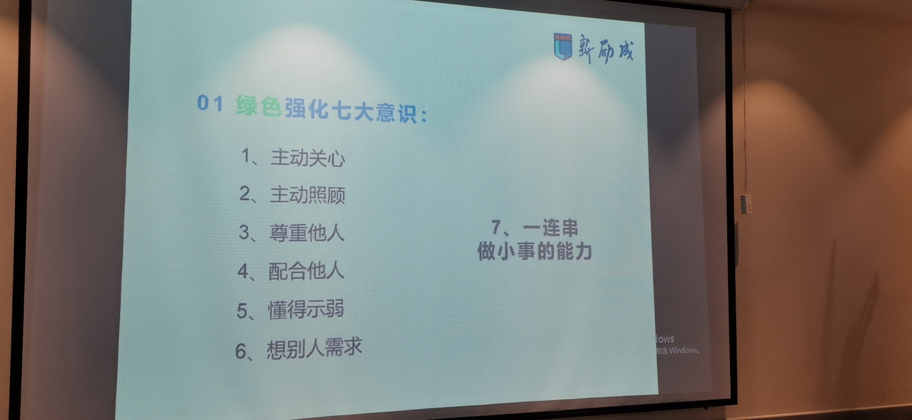

- [案例_酒席安排方案.jpeg](./pic/4/12案例_酒席安排方案.jpeg)

- [工作会议安排方案.jpeg](./pic/4/13工作会议安排方案.jpeg)

- [请客到家吃饭安排方案.jpeg](./pic/4/14请客到家吃饭安排方案.jpeg)
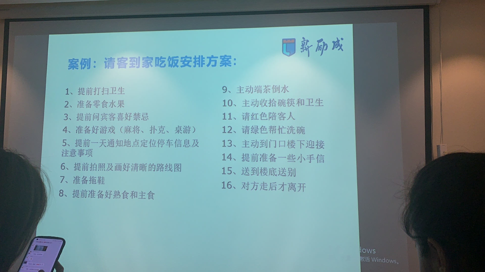

- [讨论_外出游玩做什么最能体现绿色.jpeg](./pic/4/15讨论_外出游玩做什么最能体现绿色.jpeg)

- [ 耐心法则.jpeg](./pic/4/16 耐心法则.jpeg)

- [强力不强势温柔法则.jpeg](./pic/4/17强力不强势温柔法则.jpeg)
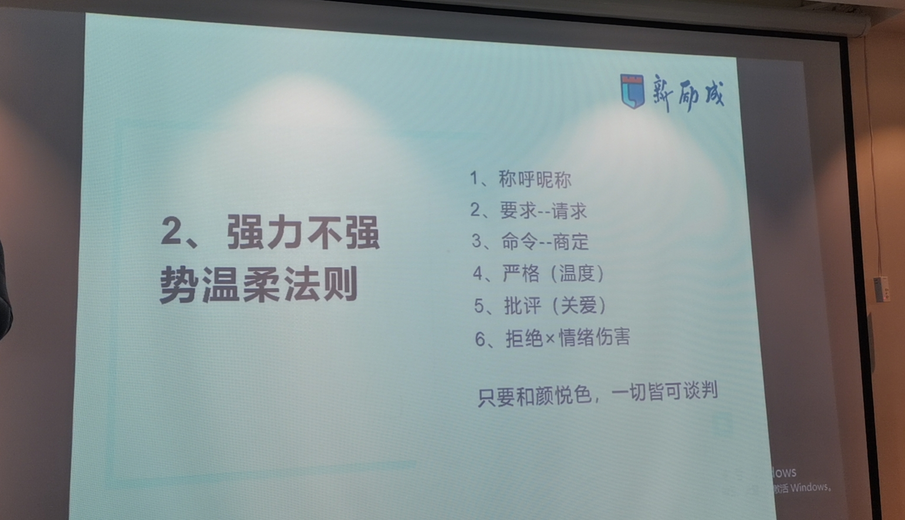

- [同理心.jpeg](./pic/4/18同理心.jpeg)
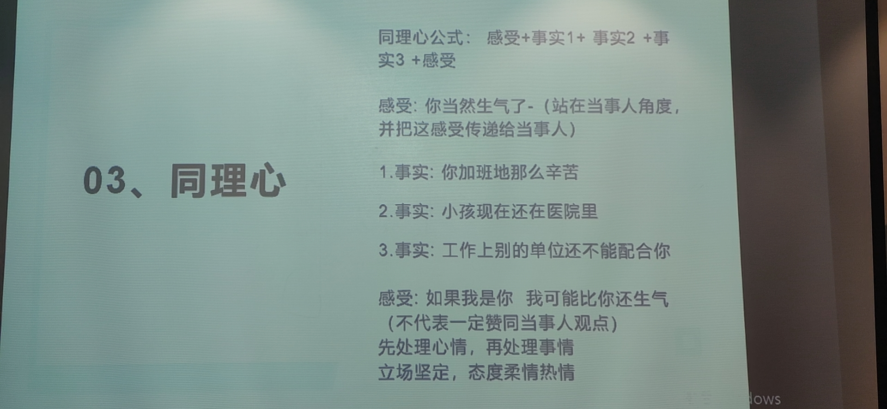

- [倾听法则.jpeg](./pic/4/19倾听法则.jpeg)

- [使用敬语.jpeg](./pic/4/20使用敬语.jpeg)

- [微笑示弱撒娇训练.jpeg](./pic/4/21微笑示弱撒娇训练.jpeg)

- [做好一点.jpeg](./pic/4/22做好一点.jpeg)

- [还有哪些提升绿色的方法和工具.jpeg](./pic/4/23还有哪些提升绿色的方法和工具.jpeg)
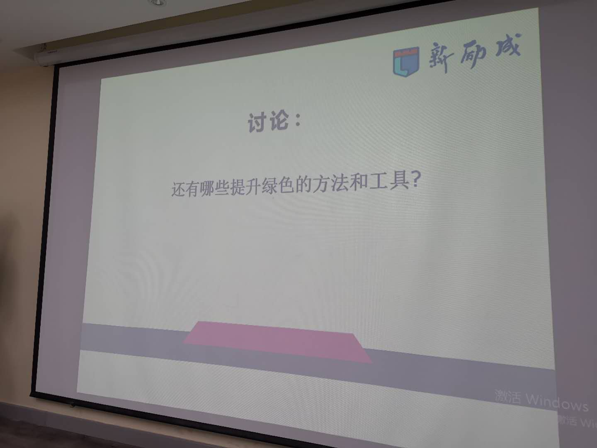

- [蓝色特质的强化.jpeg](./pic/4/24蓝色特质的强化.jpeg)

- [蓝色调整的核心内容.jpeg](./pic/4/25蓝色调整的核心内容.jpeg)
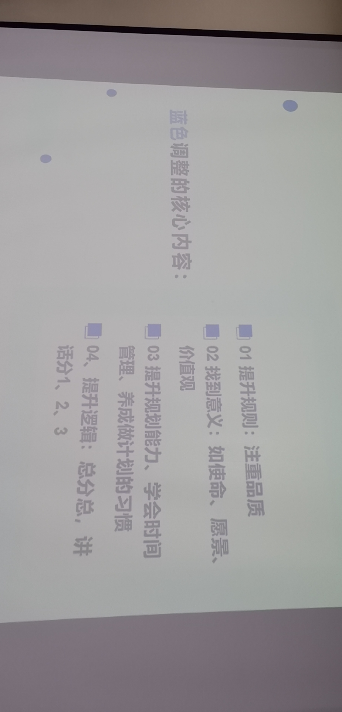

- [逻辑结构.jpeg](./pic/4/26逻辑结构.jpeg)
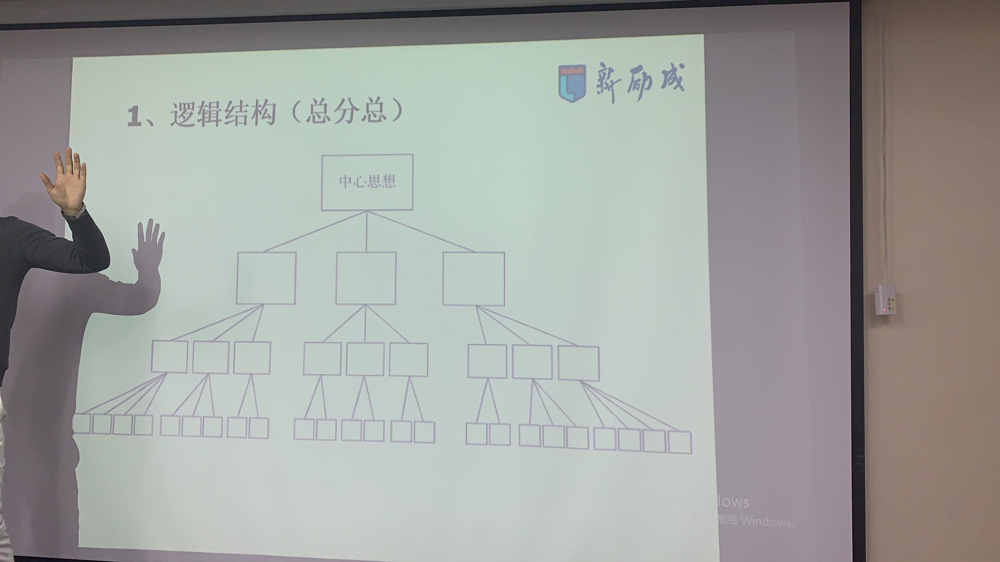

- [思维导图.jpeg](./pic/4/27思维导图.jpeg)

- [任务管理.jpeg](./pic/4/28任务管理.jpeg)

- [重要性顺序.jpeg](./pic/4/29重要性顺序.jpeg)
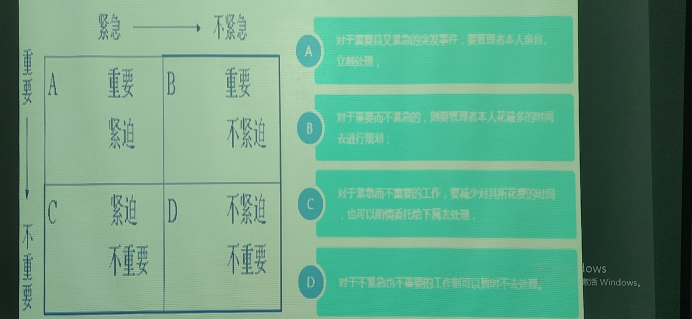

- [问题分析逻辑.jpeg](./pic/4/30问题分析逻辑.jpeg)

- [还有哪些提升蓝色方法和工具.jpeg](./pic/4/31还有哪些提升蓝色方法和工具.jpeg)
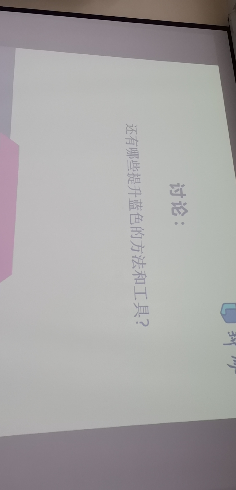

- [红色强化的核心内容.jpeg](./pic/4/32红色强化的核心内容.jpeg)
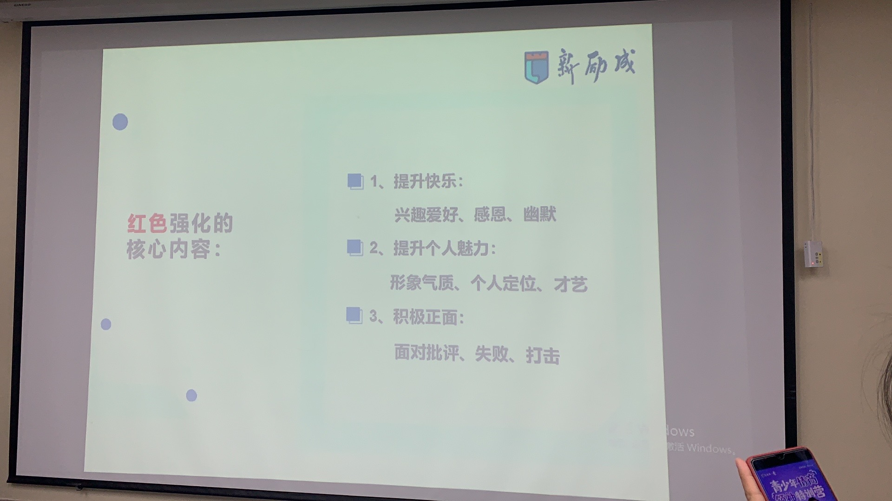

- [讲笑话法则.jpeg](./pic/4/33讲笑话法则.jpeg)

- [讲笑话时不应该做的.jpeg](./pic/4/34讲笑话时不应该做的.jpeg)

- [增加红色的快乐.jpeg](./pic/4/35增加红色的快乐.jpeg)
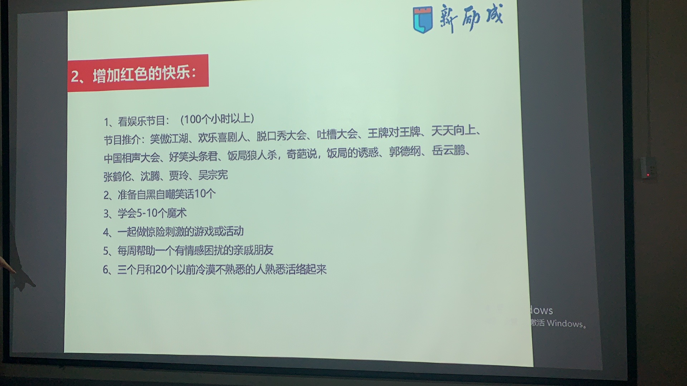

- [提升红色的魅力.jpeg](./pic/4/36提升红色的魅力.jpeg)
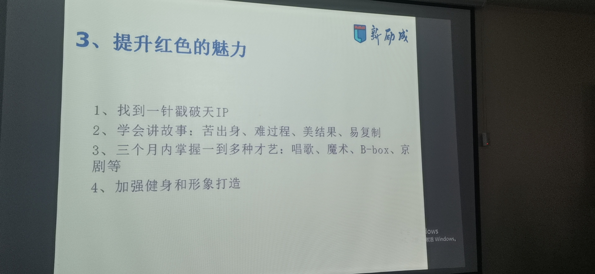

- [黄色特质的强化.jpeg](./pic/4/37黄色特质的强化.jpeg)

- [黄色强化的核心内容.jpeg](./pic/4/38黄色强化的核心内容.jpeg)
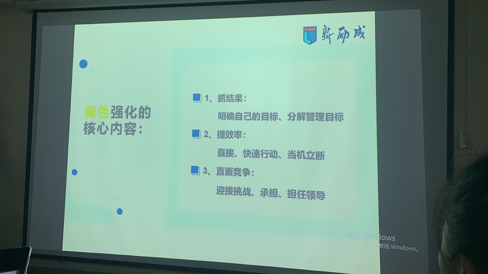

- [塑性健身.jpeg](./pic/4/39塑性健身.jpeg)
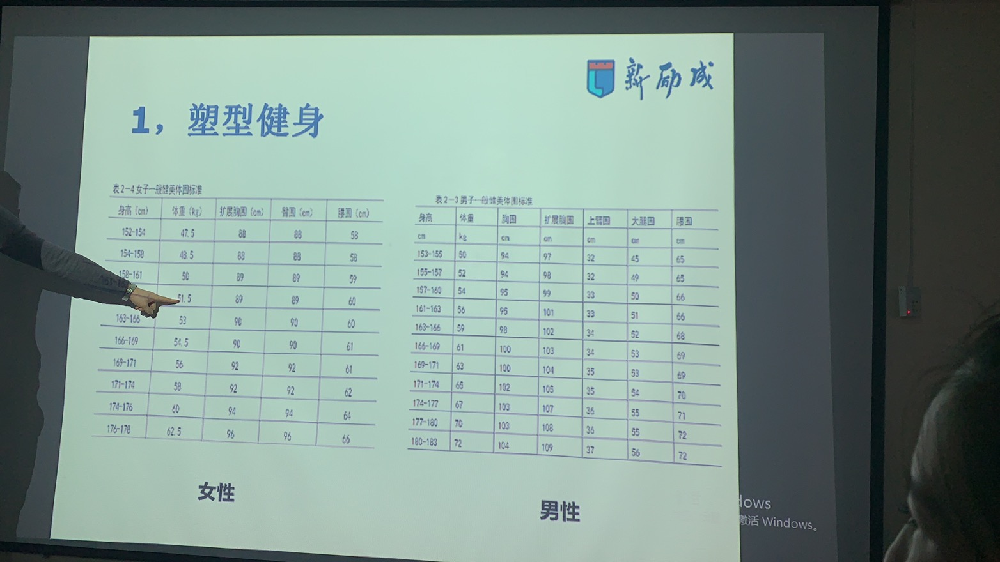

- [减肥励志视频.mp4](./pic/4/40减肥励志视频.mp4)
<video id="video" controls="" preload="none" >
      <source id="mp4" src="./pic/4/40减肥励志视频.mp4" type="video/mp4">
      </video>

- [减肥视频抖音号.jpeg](./pic/4/41减肥视频抖音号.jpeg)

- [目标管理.jpeg](./pic/4/42目标管理.jpeg)

- [瘦身饮食方式.jpeg](./pic/4/43瘦身饮食方式.jpeg)

- [挑战21天练出完美身材_抖音号a1021339105.mp4](./pic/4/44挑战21天练出完美身材_抖音号a1021339105.mp4)

- [目标承诺.jpeg](./pic/4/45目标承诺.jpeg)
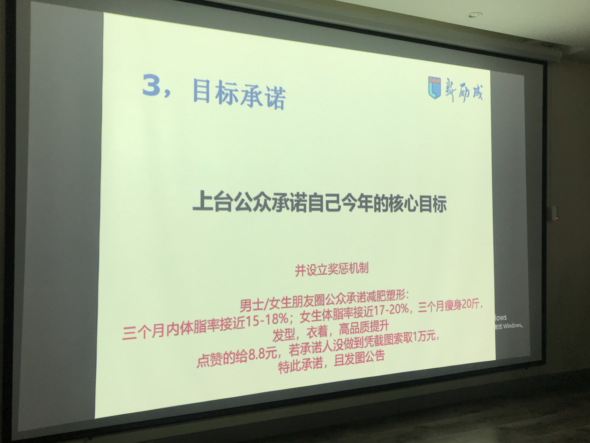

- [零基础暴汗减脂视频.mp4](./pic/4/46零基础暴汗减脂视频.mp4)

- [男生集体订立目标.jpeg](./pic/4/47男生集体订立目标.jpeg)

- [男生集体订立目标视频.mp4](./pic/4/48男生集体订立目标视频.mp4)

- [女生集体订立目标视频.mp4](./pic/4/49女生集体订立目标视频.mp4)

- [性格色彩缺陷调整推荐.jpeg](./pic/4/50性格色彩缺陷调整推荐.jpeg)
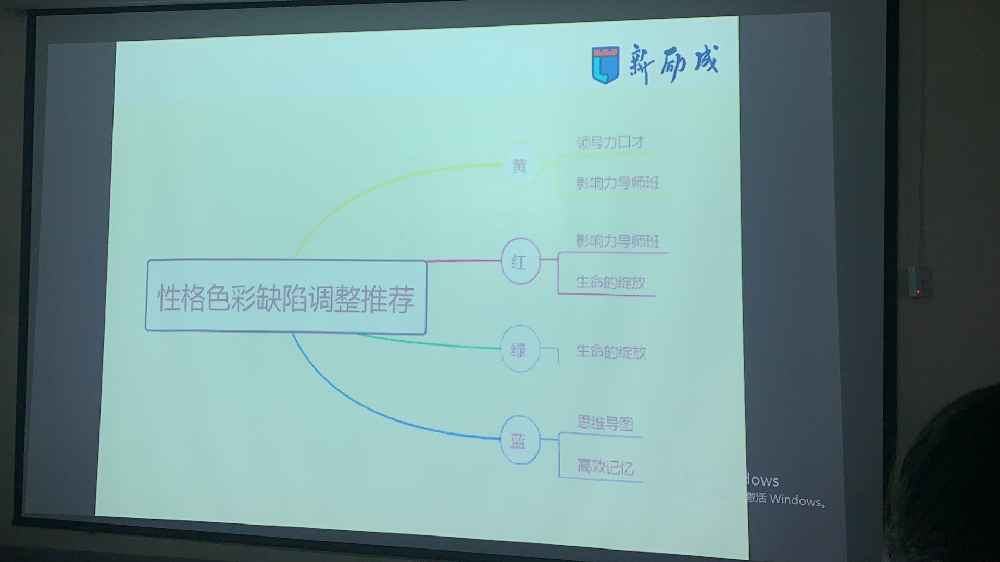

- [性格的16种组合.jpeg](./pic/4/51性格的16种组合.jpeg)
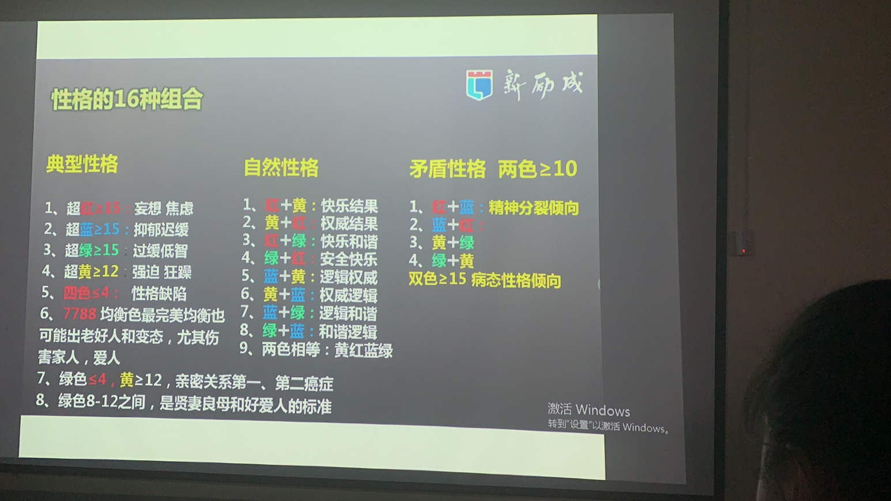

- [性格解析简易版.jpeg](./pic/4/52性格解析简易版.jpeg)

- [各色优势分析.jpeg](./pic/4/53各色优势分析.jpeg)

- [咨询中性格判断话术.jpeg](./pic/4/54咨询中性格判断话术.jpeg)

- [咨询中四色常见表现及应对方法.jpeg](./pic/4/55咨询中四色常见表现及应对方法.jpeg)
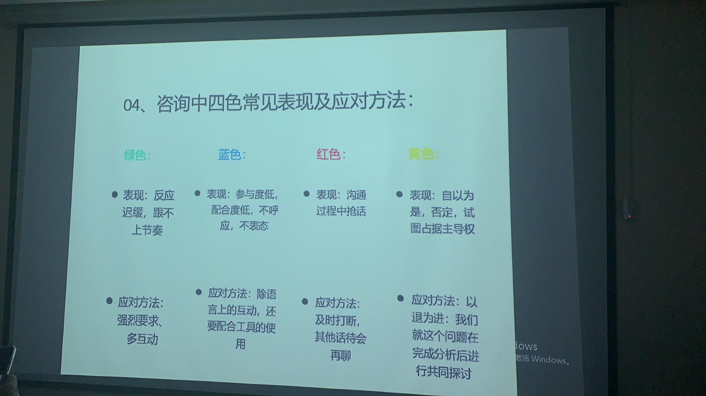

- [举例四种情况如何分析.jpeg](./pic/4/56举例四种情况如何分析.jpeg)
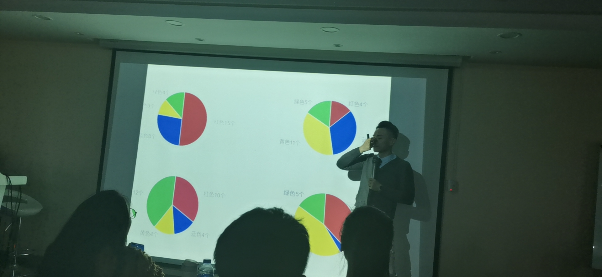

- [性格调整5阶段.jpeg](./pic/4/57性格调整5阶段.jpeg)

- [作业_1月32人分析32电影分析.jpeg](./pic/4/58作业_1月32人分析32电影分析.jpeg)
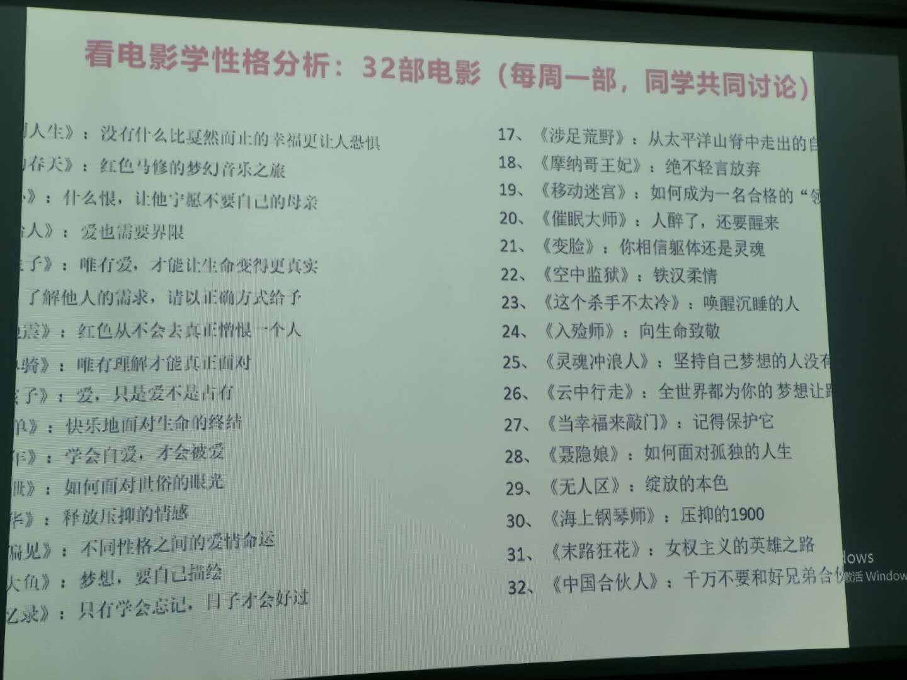

