犹太式学习方式
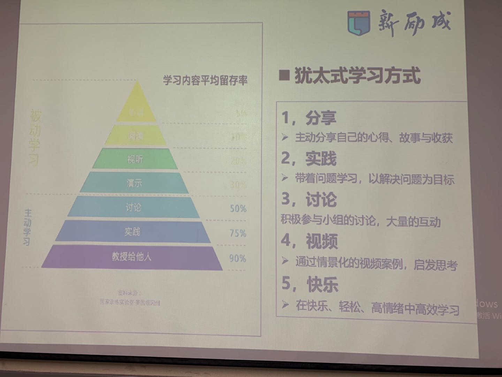

性格特质的分类

个人性格成因

红黄蓝绿四个小孩

孩子与家庭表现对照

教育、职业与社会对性格的影响

四种性格基本特征
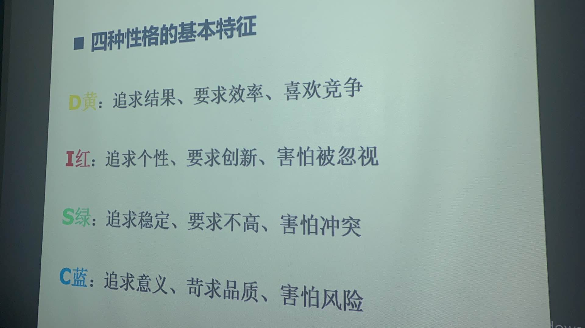

四种性格基本特征2

四种性格的内在动机

性格饼图与行为的关系

小刺猬视频
[10小刺猬视频.mp4](./pic/1/10小刺猬视频.mp4)

关于性格的金句

绿色性格的优势
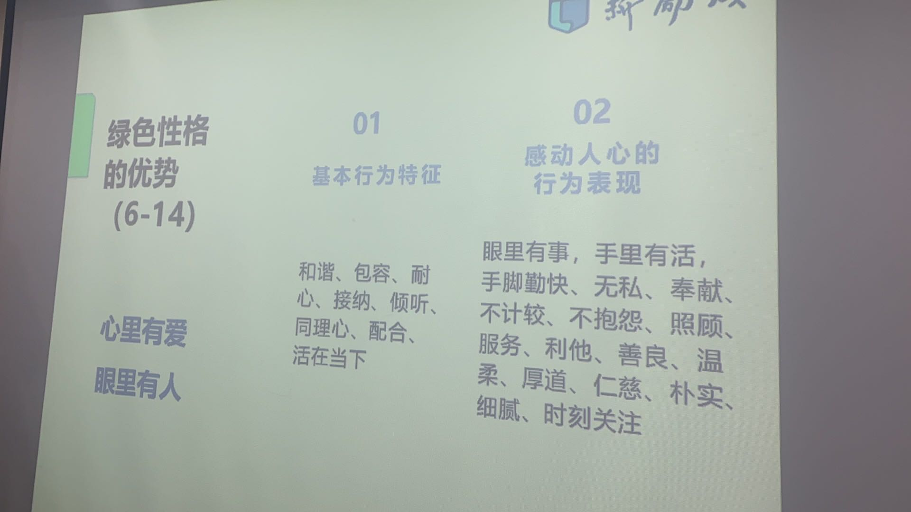

绿色性格的辨别方法

绿色沟通特点

绿色女性
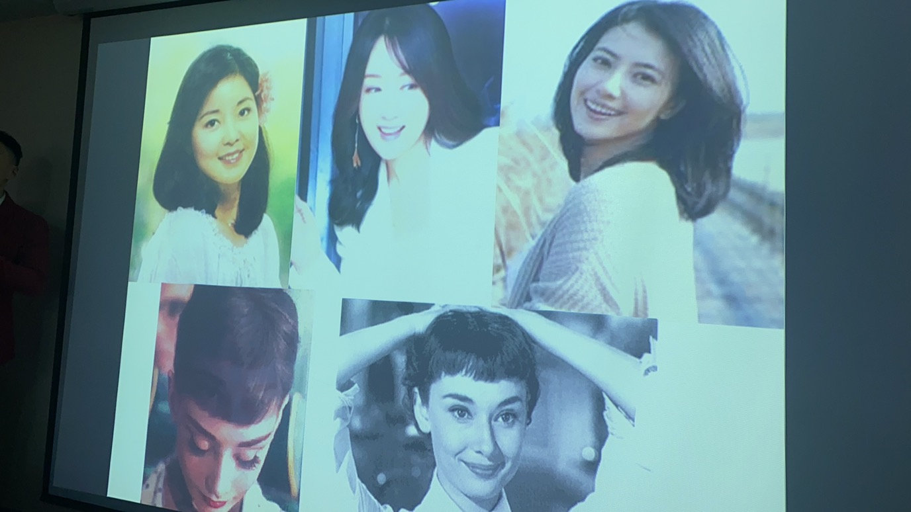

绿色男性

绿色金句

讨论绿色性格特质
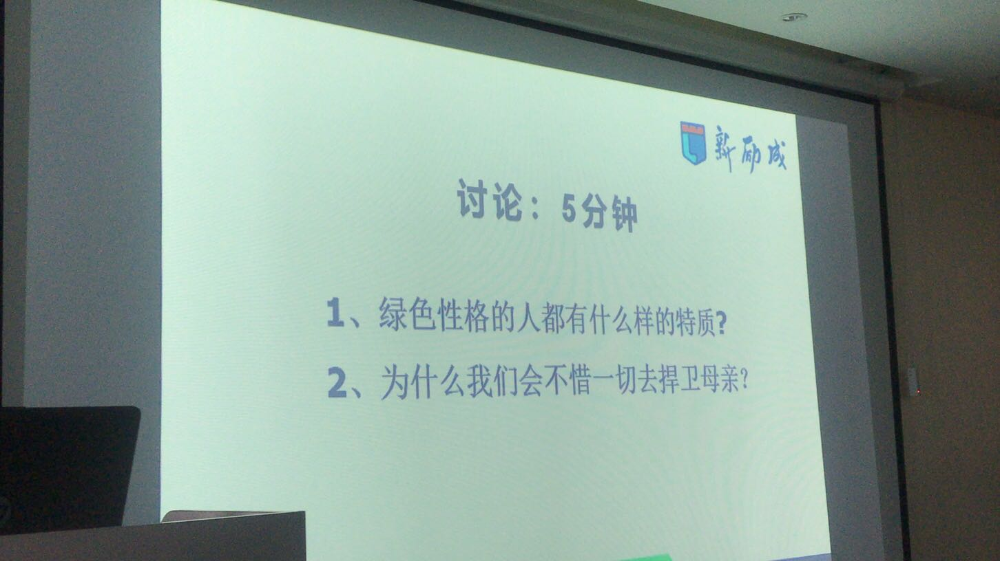

视频_感恩要及时_子欲养而亲不在

绿色性格激活黄色性格示范_50离地俯卧撑_30单手俯卧撑
[08绿色性格激活黄色性格示范_50离地俯卧撑_30单手俯卧撑.mp4](./pic/2/1green/08绿色性格激活黄色性格示范_50离地俯卧撑_30单手俯卧撑.mp4)

课后作业

蓝色性格优势

蓝色男性

蓝色性格辨别方法

蓝色沟通特点

蓝色金句总结

红色优势
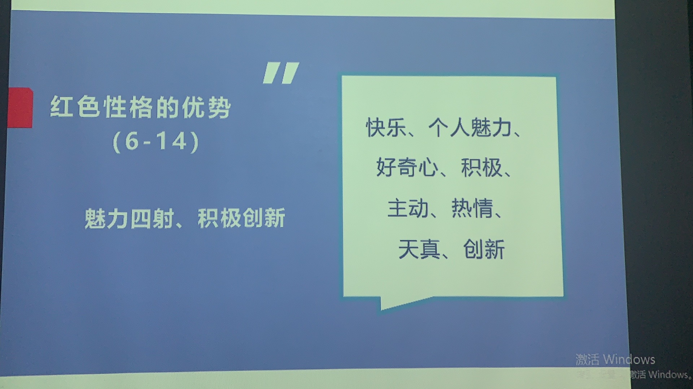

红色宝宝示范
[11红色宝宝示范.mp4](./pic/2/3red/11红色宝宝示范.mp4)

调动红色的歌曲_海阔天空
[12调动红色的歌曲_海阔天空.mp4](./pic/2/3red/12调动红色的歌曲_海阔天空.mp4)

红色性格的辨别方法

红色代表人物

红色性格的沟通特点

红色金句总结

黄色性格优势

调动黄色的歌曲
[19调动黄色的歌曲.mp4](./pic/2/4yellow/19调动黄色的歌曲.mp4)

黄色性格辨别方法

不同性格的幽默方式

黄色性格辨别方法2

黄色代表人物

黄色沟通特点

黄色金句总结
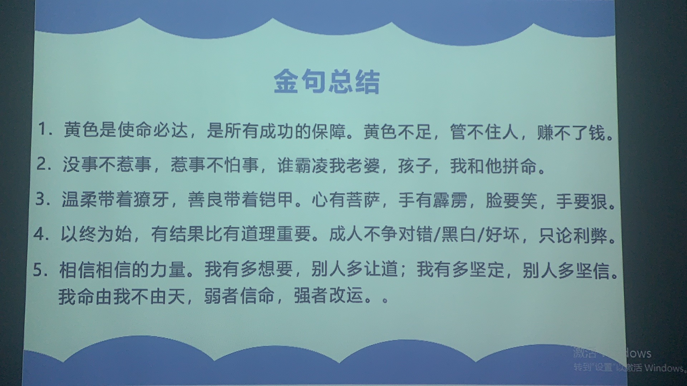

第三讲性格的运用

开始一件事方式和障碍_红_绿

开始一件事方式和障碍_黄_蓝

对时间管理的态度
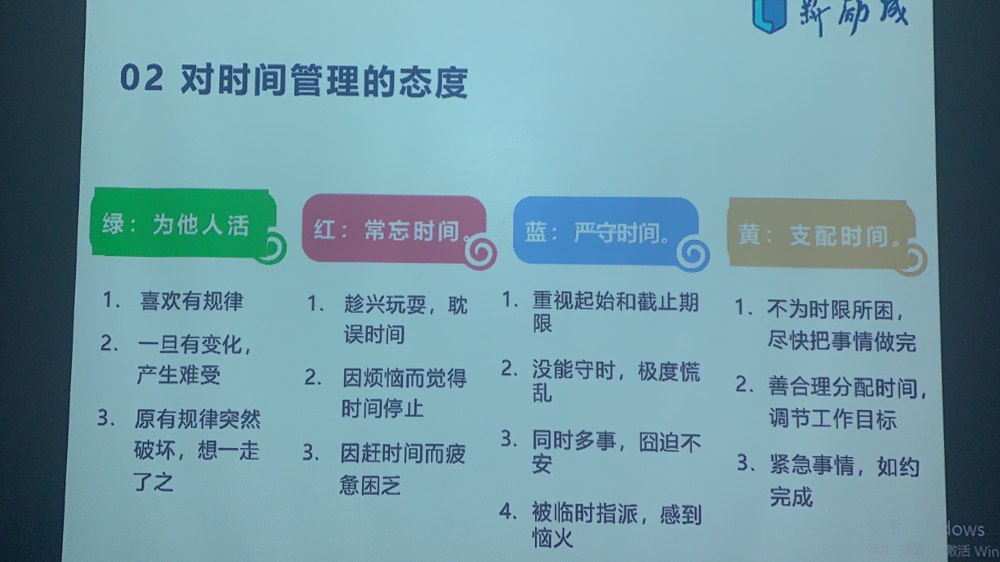

压力的来源和调节_红_绿

压力的来源和调节_蓝_黄

进入陌生场合的做法

不同性格的幽默方式

如何避免吵架和冲突

不同性格面对被骂的反应

不同性格的记仇和报复方式

不同性格的人如何夸奖

如何追不同性格的对象

不同性格的人如何面对婚姻
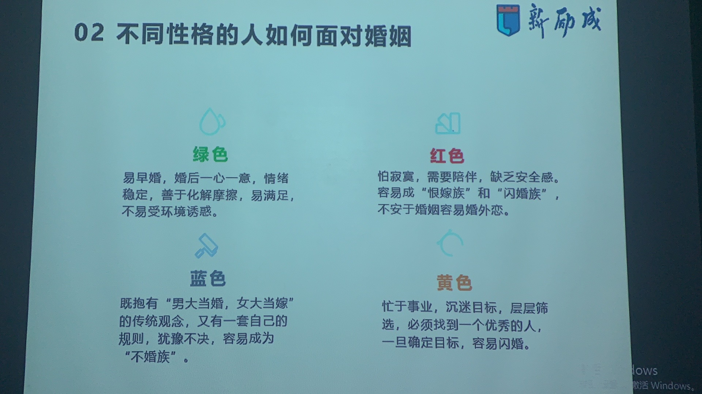

如何与不同性格的伴侣相处_绿_红

如何与不同性格的人相处_蓝_黄
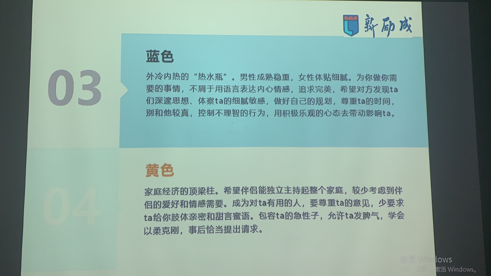

不同性格女人产生怀疑的做法

不同性格男人产生怀疑的做法

如何消灭不同性格的出轨

不同性格失恋后的反应

不同性格父母如何教育孩子_绿_红

不同性格父母如何教育孩子_蓝_黄

不同性格孩子如何教育_绿_红

不同性格孩子如何教育_蓝_黄

不同性格如何选择职业_绿

不同性格如何选择职业_红

不同性格如何选择职业_蓝

不同性格如何选择职业_黄
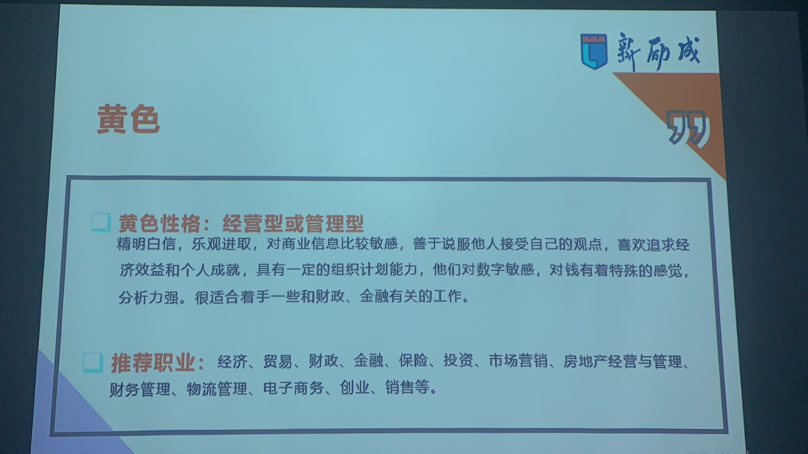

不同性格如何面对规则
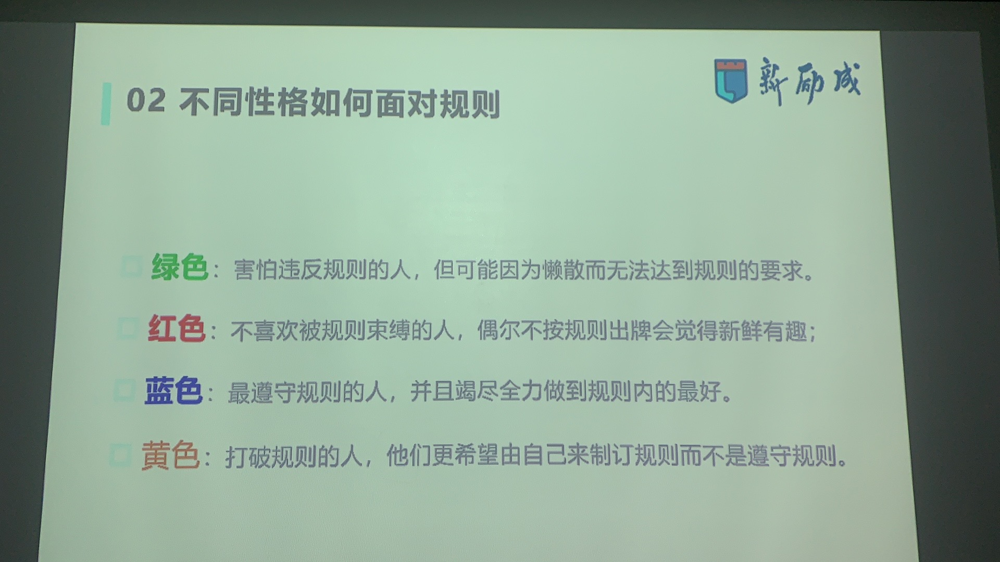

不同性格如何在团队中发挥作用_红_绿

不同性格如何在团队中发挥作用_蓝_黄

如何与不同性格同事相处_绿_红

如何与不同性格同事相处_蓝_黄

如何影响不同性格的下属_蓝_绿
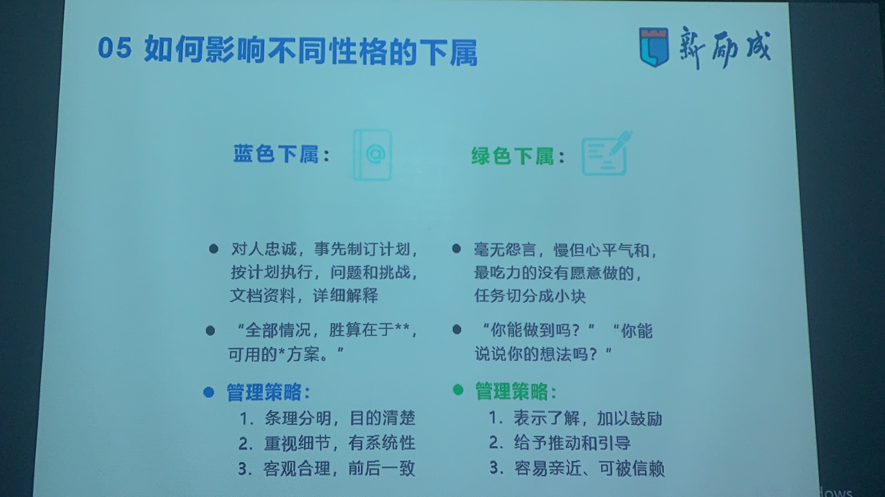

如何影响不同性格的下属_黄_红

如何与不同性格老板谈加薪_蓝_绿

如何与不同性格老板谈加薪_黄_红

不同性别的客户如何销售与服务

课后读书_玩转DISC

学员分享分析

各色过当与缺陷的数值参考

性格分裂与完美人格的数值参考

四色过当的表现_绿_蓝

四色过当的表现_红_黄

四色缺陷的表现

四种性格调整的底层逻辑

各色特质

各色调整后的好处

绿色特质的强化

绿色强化7大意识

案例_酒席安排方案

工作会议安排方案

请客到家吃饭安排方案

讨论_外出游玩做什么最能体现绿色

 耐心法则

强力不强势温柔法则

同理心

倾听法则

使用敬语

微笑示弱撒娇训练

做好一点

还有哪些提升绿色的方法和工具

蓝色特质的强化

蓝色调整的核心内容

逻辑结构

思维导图

任务管理

重要性顺序

问题分析逻辑

还有哪些提升蓝色方法和工具
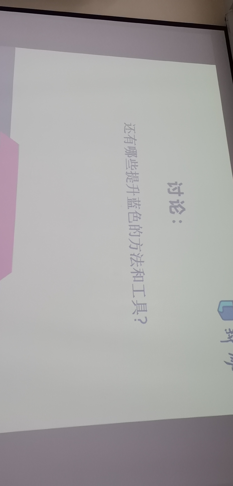

红色强化的核心内容

讲笑话法则

讲笑话时不应该做的

增加红色的快乐

提升红色的魅力

黄色特质的强化

黄色强化的核心内容

塑性健身

减肥励志视频
[40减肥励志视频.mp4](./pic/4/40减肥励志视频.mp4)

减肥视频抖音号

目标管理

瘦身饮食方式

挑战21天练出完美身材_抖音号a1021339105
[44挑战21天练出完美身材_抖音号a1021339105.mp4](./pic/4/44挑战21天练出完美身材_抖音号a1021339105.mp4)

目标承诺

零基础暴汗减脂视频
[46零基础暴汗减脂视频.mp4](./pic/4/46零基础暴汗减脂视频.mp4)

男生集体订立目标

男生集体订立目标视频
[48男生集体订立目标视频.mp4](./pic/4/48男生集体订立目标视频.mp4)

女生集体订立目标视频
[49女生集体订立目标视频.mp4](./pic/4/49女生集体订立目标视频.mp4)

性格色彩缺陷调整推荐

性格的16种组合

性格解析简易版

各色优势分析

咨询中性格判断话术

咨询中四色常见表现及应对方法

举例四种情况如何分析

性格调整5阶段

作业_1月32人分析32电影分析
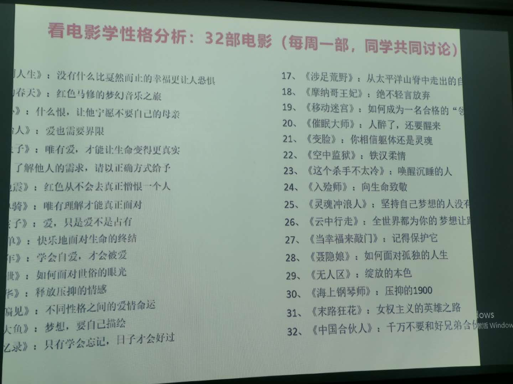

